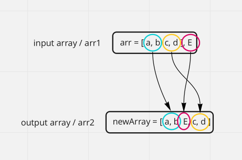

# Insert to Middle of an Array

## Problem Domain

***Challenge:*** Write a function called `insertShiftArray` which takes in an array and a value to be added. Without utilizing any of the built-in methods available to your language, return an array with the new value added at the middle index.

## Input & Output Examples

Input: `[2, 4, 6, -8], 5`\
Output: `[2, 4, 5, 6, -8]`

Input: `[42, 8, 15, 23, 42], 16`\
Output: `[42, 8, 15, 16, 23, 42]`

## Whiteboard Process - Visual

## Algorithm

Iterate through the input array

    - For the first half of the array, push the values into a new array with the same index values
    - Add the input value as the middle value of the new array
    - For the second half of the array, push the values into the new array with the original index + 1

## Pseudocode

INPUT: `arr1`, `newValue`\
OUTPUT: `arr2`

VARIABLES:

- `arr2`
- `START`
- `MID`

If `arr1` length is _even_

- MID <- `arr1/2`

If `arr1` length is _odd_

- MID <- `(ARR1+1)/2`

For `arr1` when _`arr1` length < MID_

`arr1` = `arr2`

`arr2[MID]` = `newValue`

For `arr1` when _`arr1` >= MID_

`arr1[index]` = `arr2[index+1]`

Return `arr2`
