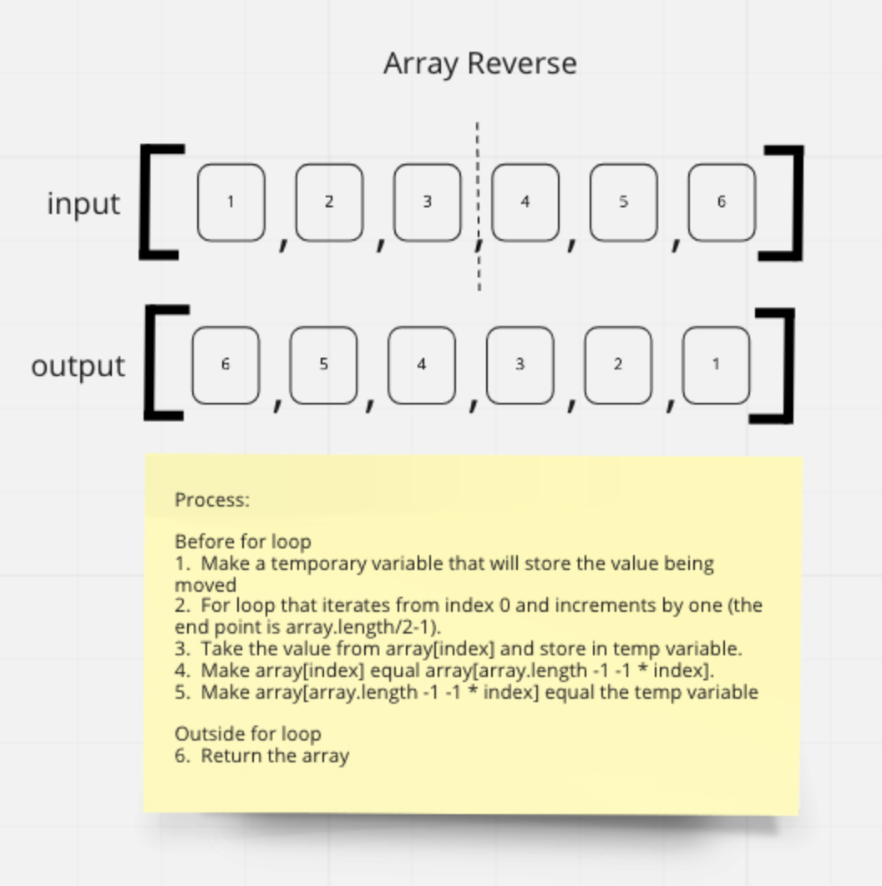

# Array Reverse

## Problem Domain

Create a function which takes an array as an argument and returns an array with the elements in reverse order.

## Input & Output Examples

Input: `[1, 2, 3, 4, 5, 6]`\
Output: `[6, 5, 4, 3, 2, 1]`

Input: `[-5, 70, 44, -1, 12, 13]`\
Output: `[13, 12, -1, 44, 70, -5]`

## Whiteboard Process - Visual

## Algorithm

By swapping the beginning (start) and the end of the array we can reverse their positions.

- iterate through the array starting at the first item.
- iterate until we reach the halfway point of the array.
- for each item, swap with the value mirrored on the other half of the array.

## Pseudocode

INPUT - Array
OUTPUT - Reverse Array

DECLARE START <- 0
DECLARE END <- Index array length minus 1\
DECLARE TEMP <- Array item at START

>WHILE CURRENT ITEM < ARRAY LENGTH/2
>
  >END <- START\
  >START <- TEMP\
  >END decrement by 1\
  >START increment by 1\
  >TEMP <- array item at START

RETURN ARRAY
