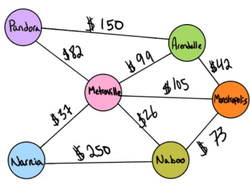

# Graph-Business-Trip (find edges)

## Problem Domain

Given a business trip itinerary, and an Alaska Airlines route map, is the trip possible with direct flights? If so, how much will the total trip cost be? Determine whether the trip is possible with direct flights, and how much it would cost.

## Inputs / Outputs

input: graph, array of city names
return: cost or null



input: [ Metroville, Pandora, ]
return: True, $82

input: [ Arendelle, New Monstropolis, Naboo ]
return: True, $115

input: [ Naboo, Pandora ]
return: False, $0

input: [ Narnia, Arendelle, Naboo ]
return: False, $0

## Algorithm

```md
DECLARE starting price at 0
DO get all the vertices of the graph
ITERATE loop through the city name array
DO check the adjacency table to see if the city name exists in the trip graph
CONDITION if not return false and current price
CONDITION if it does, add to the price (edge weight)
DO Continue looping through city array until you reach the end
RETURN true and total price
```

## Optimization

Time: `O(V)`
Space: `O(V^2)` where V is the number of vertices

## Link to Solution Code

[Graph - Business Trip - index.js](./index.js)

## Test Suite

[Graph - Business Trip Test Suite](./__tests__/businessTrip.test.js)
