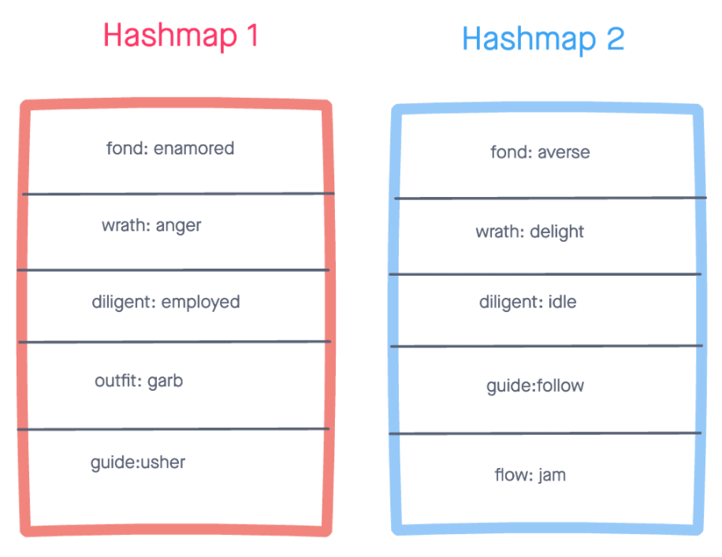

# Hashmap Left-Join

## Problem Domain

Write a function that joins two hashmaps, leftly, into a single data structure. This function takes in two hash maps as arguments. First parameter is a hashmap that has word strings as keys, and a synonym of the key as it's value. Second parameter is a hashmap that has word strings as keys, and antonyms of the key as it's value. The function returns an array of objects that holds the word, synonym, and antonym properties.

## Example Input / Output

Input: 2 hash maps



Output:

```md
[
  { word: 'fond', synonym: 'enamored', antonym: 'averse' },
  { word: 'wrath', synonym: 'enamored', antonym: 'delight' },
  { word: 'diligent', synonym: 'employed', antonym: 'idle' },
  { word: 'outfit', synonym: 'garb', antonym: null },
  { word: 'guide', synonym: 'usher', antonym: 'follow' }
]
```

## Algorithm

```md
DECLARE an empty array
DO search through each key in first hash map
CONDITION for each key
DO push an object into the array containing the word, the synonym and antonym if present
DO use built in hashmap .get method to obtain the values associated with each key
RETURN words array
```

## Optimization

Time: `O(n)` - traverse through the first hash map one time, `n` times

Space: `O(n)` because we are creating an array of objects that would `n` long, regardless.

## Link to Solution Code

[Hashmap Left Join - index.js](./index.js)

## Test Suite

[Hashmap Left Join Test Suite](./__tests__/left-join.test.js)
