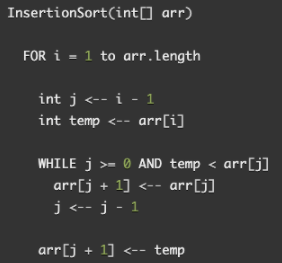

# Insert-Sort

Insertion Sort is a function that takes in an unsorted array and sorts it in ascending order. It traverses through the array comparing the current element's value to the previous element, moving the current element in front of the previous element if it's value is smaller than. It continues through the entire array until end is reached.

## Algorithm

    1). Iterate through array starting at index 1, array[1], until you reach the end of the array array[length - 1].

    2). Upon each iteration, compare the current element to the previous element.

    3). If, current element is smaller than the previous element, compare it to the proceeding element. Continue until you find an element that it is greater than.

    4). Move the elements that are greater in value than the current element to the right in the array, one position up, to make space for the swapped, current element.

## Pseudocode



## Steps

### _Example Input Array_

`[ 8, 4, 23, 42, 16, 15 ]`

### Step 1

- First pass through, for loop starts at index `1`.
- Current value `(4)` is < previous `i` value `(8)`, enter while loop.
- Set current index value to previous index value.
- Increment the previous index until front of the array is hit or until current value is greater than previous, breaking out of the while loop.
- Upon exciting the while loop, set `currentValue` to `previousIndex + 1` to finish the swap.

```
for loop iteration: 1
previousIndex: 0
currentValue: 4
total while loop iterations: 1
```

### Step 2

- In second pass, for loop starts at index `2`.
- Current value `(23)` is greater than previous index value `(8)`, _DO NOT_ enter the while loop.

```
for loop iteration: 2
previousIndex: 1
currentValue: 23
total while loop iterations: 0
```

### Step 3

- In third pass, for loop starts at index `3`.
- Current value `(42)` is greater than previous index value `(23)`, enter the while loop.

```
for loop iteration: 3
previousIndex: 2
currentValue: 42
total while loop iterations: 0
```

### Step 4

- In fourth pass, for loop starts at index `4`.
- Current value `(16)` is less than previous index value `(42)`, enter the while loop.
- Set current index value to equal the array at previous index value.
- Increment previous index until you hit the front of the array or until current value is `>` previous, break out of the while loop.
- `16` is < `23`, continue in the while loop.
- `16` is > `8`, break out of the while loop.
- Once, out of the while loop, set the `currentValue` to the `previousIndex + 1` to finish the swap.

```
for loop iteration: 4
previousIndex: 3
currentValue: 16
total while loop iterations: 2
```

### Step 5

- In fifth pass, for loop starts at index `5`.
- Current value `(15)` is < previous index value `(42)`, enter the while loop.
- Set current index value to equal the array at the previous index value.
- Increment the previous index until you hit the front of the array or until current value is greater than previous, breaking out of the while loop.
- Since 15 is less than 23, you continue in the while loop.
- Since 15 is less than 16, you continue in the while loop.
- 15 is greater than 8, breaking us out of the while loop.
- Once, out of the while loop, set the currentValue to the previousIndex + 1 to finish the swap.

```
for loop iteration: 5
previousIndex: 4
currentValue: 15
total while loop iterations: 3
```

## Optimization

Time: O(n^2)

Space: O(1)
