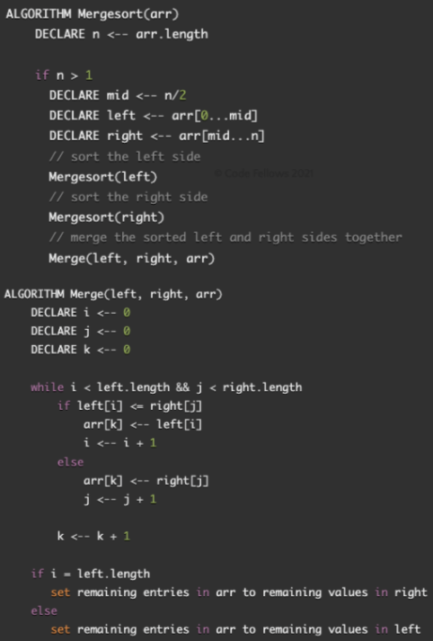

# Merge-Sort

Merge Sort is a function that takes in an unsorted array and splits it in half until each sub-array contains one element. Then, it merges the sub-arrays back together, in ascending order until a final sorted array is reached.

## Algorithm

    1). Split the input array into two halves.
    2). Continue splitting the sub-arrays in half until the sub-arrays contain only one element.
    3). Now, begin merging the single element sub-arrays with one another in ascending order.
    4). Repeat step 3 until all sub-arrays have been merged into one final array.

## Pseudocode



## Steps

### _sample input array_

`[8,4,23,42,16,15]`

### Step 1

- Split the initial array into two sub-arrays using the middle index.

```
mid 3
left [ 8, 4, 23 ]
right [ 42, 16, 15 ]
```

- Continue splitting the sub-array using the middle index.

```
mid 1
left [ 8 ]
right [ 4, 23 ]
```

### Step 2

- Split the sub-array again.
  - Now each sub-array has a length of 1 and cannot be split any further.

```
mid 1
left [ 4 ]
right [ 23 ]
```

### Step 3

- Now we break into merge function and begin merging the left side.
- Once the left side is merged, we hop over to the right side to split the right array into sub-arrays.

```
mid 1
left [ 42 ]
right [ 16, 15 ]
```

### Step 4

- Continue splitting the sub-array using the middle index.

```
mid 1
left [ 16 ]
right [ 15 ]
```

### Step 5

- Now we break into merge function and begin merging the right side.
- Continue merging.
- Once the right side is merged, we merge with the left side to receive the final array in sorted order.

## Optimization

`divide-and-conquer` algorithm

**Time: O(n log n)** it takes `n` steps to merge arrays, `log n` times

**Space: O(n)** it uses n elements stored in arrays to merge, it consumes `O(n)` space.
