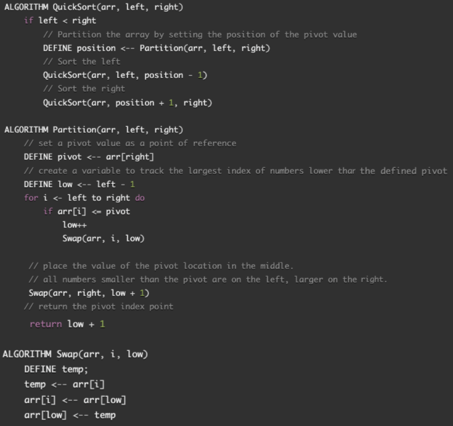

# Quick-Sort, Recursive Method

Quick Sort is a function that takes in an unsorted array and sorts it in ascending order, by partitioning ("A partition is a division of a logical database or its constituent elements into distinct independent parts. Database partitioning is normally done for manageability, performance or availability reasons, or for load balancing." Source: [WikiPedia - Partition](https://en.wikipedia.org/wiki/Partition_(database))) the array, using a pivot value to determine whether elements should be sorted to the left or right. The array is sorted in place.

## Algorithm

    1). Select a pivot element in the array. In this example, we'll use the last element in the array.
    2). Sort the elements of the array. Elements to the left of the pivot are smaller than the pivot and  elements to the right are greater than the pivot. This process is called partitioning. If an element is equal, it will go to the right.
    3). Repeat this process for the left and right side of the pivot, until the array is sorted.

## Pseudocode

## Steps

### _sample input array_

`[8,4,23,42,16,15]`

### Step 1

- To begin, set the last element in the array as the pivot.
- Set the variable `pivotIndex` to help us keep track of the "`middle`" position where we will eventually put the pivot value once the left and right have been sorted. _(to the left are values smaller than the pivotValue and right are values larger than)_
- Now, `23` is at the end of the array now. This is because we swapped it with the `pivotValue` of `15` because `15` needs to be at `index 2` to be in the middle of the left and ride that has been sorted.

### Step 2

- `4` is now the pivot on our left side and we compare it with the value of `8`. Since `8` is larger, `8` and `4` switch and we move to the right.
- `23` is now our pivot value on the right side.

### Step 3

- We compare `42` and `16` with `23` and sort them to the right and left respectively.

### Step 4

- Now, the array has been sorted!

## Optimization

`divide-and-conquer` algorithm

Time: O(n log n) it takes n steps to partition the array, at log n times.

Space: O(1) Since it only swaps elements within the array and does not create sub-arrays, it uses O(1) space.
