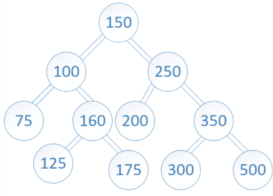

# tree-intersection

Find common values in 2 binary trees.

## Feature Tasks

- Write a function called tree_intersection that takes two binary trees as parameters.
- Using your Hashmap implementation as a part of your algorithm, return a set of values found in both trees.

## Example

### Input

### Output

100,160,125,175,200,350,500
