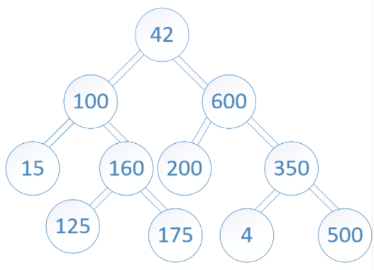

# tree-intersection

Find common values in 2 binary trees. The function takes in two binary trees as parameters and utilizes a previoously biult Hashmp implemetnation to return a set of values found in both sets of trees.

## Feature Tasks

- Write a function called tree_intersection that takes two binary trees as parameters.
- Using your Hashmap implementation as a part of your algorithm, return a set of values found in both trees.

## Example

### Input




### Output

`[ 100, 160, 125, 175, 200, 350, 500 ]`

## Algorithm

```md
DECLARE values array
DO traverse tree 1, storing each node in a hashmap
DO traverse tree 2
check to see if that node is already in the hashmap, if it is push it into values array
CONDITION if not, continue traversing
RETURN values array
```

## Optimization

Time: O(n) - traverse both trees in their entirety to compare all values.

Space: O(n) - with creation of a Hashmap, values are stored in tree1 and declared values array stores all duplicate values.

## Link to Solution Code

- _[Tree Intersection](./tree-intersection.js)_

## Test Suite

- _[Tree intersection Test Suite](./__tests__/tree-intersection.test.js)_
