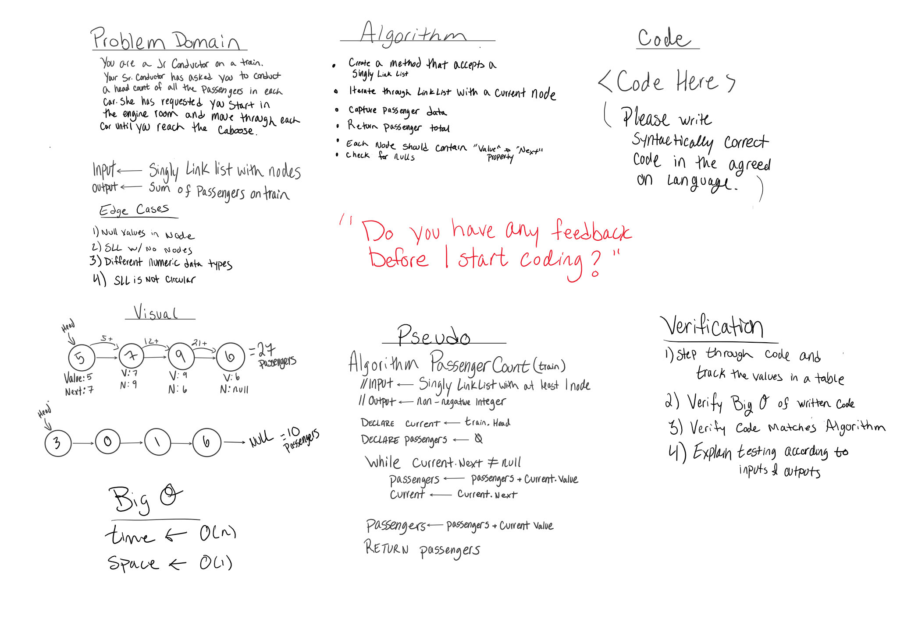
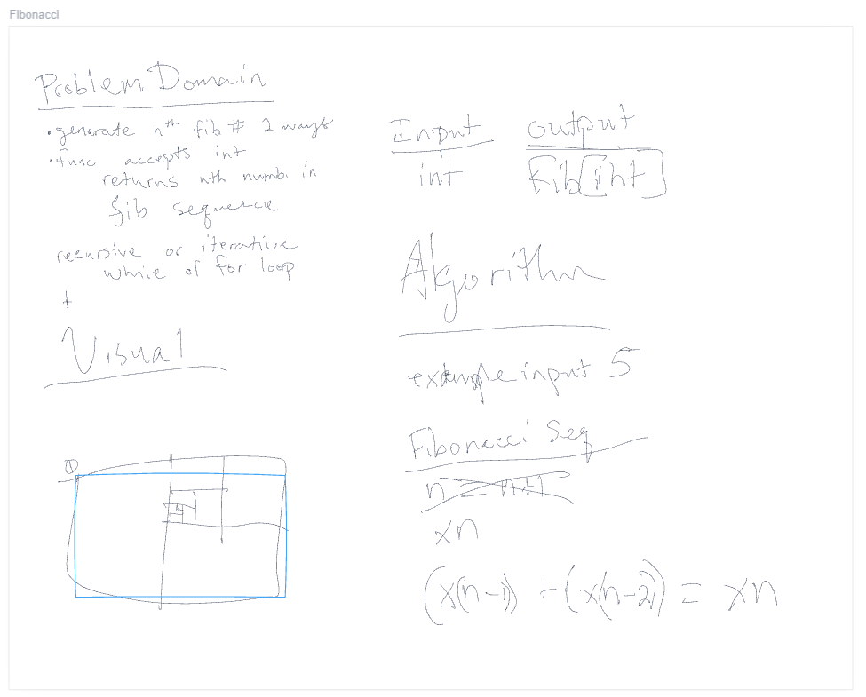

# Code Challenge 04

## The Mock Interview

## Interview 01 - Matrix

### Interviewer - _`Justin Hamerly-Spain`_

### Interviewee - _`Christopher Burk`_

_[Code Fellows - Interview 01](https://codefellows.github.io/common_curriculum/data_structures_and_algorithms/Code_401/class-04/interview-01.html)_\
_[Technical Interview Grading Rubric](https://docs.google.com/spreadsheets/d/1scthkmARfzAFZrSYAp6LA2coOaoWUWbSzMbtIU4jcHw/edit?usp=sharing)_

### Example Whiteboard

### Interview 01 Final Result

_[Christopher Burk - Technical Interview](https://docs.google.com/spreadsheets/d/1GzQzhwzO1_iCtZKgTxyIPOH8TEu_OCeySNT_wSBO5lo/edit?usp=sharing)_

## Interview 02 - Fibonacci Sequence

### Interviewer - _`Christopher Burk`_

### Interviewee - _`Justin Hamerly-Spain`_

_[Code Fellows - Interview 02](https://codefellows.github.io/common_curriculum/data_structures_and_algorithms/Code_401/class-04/interview-02.html)_\
_[Technical Interview Grading Rubric](https://docs.google.com/spreadsheets/d/1scthkmARfzAFZrSYAp6LA2coOaoWUWbSzMbtIU4jcHw/edit?usp=sharing)_

### Whiteboard Example

### Interview 02 Final Result

_[Justin Hamerly-Spain - Technical Interview](https://docs.google.com/spreadsheets/d/1ymcgtLhn6eRpRb1XEsVASTqtW5TbP0DTV8l5VWvUY6I/edit?usp=sharing)_

